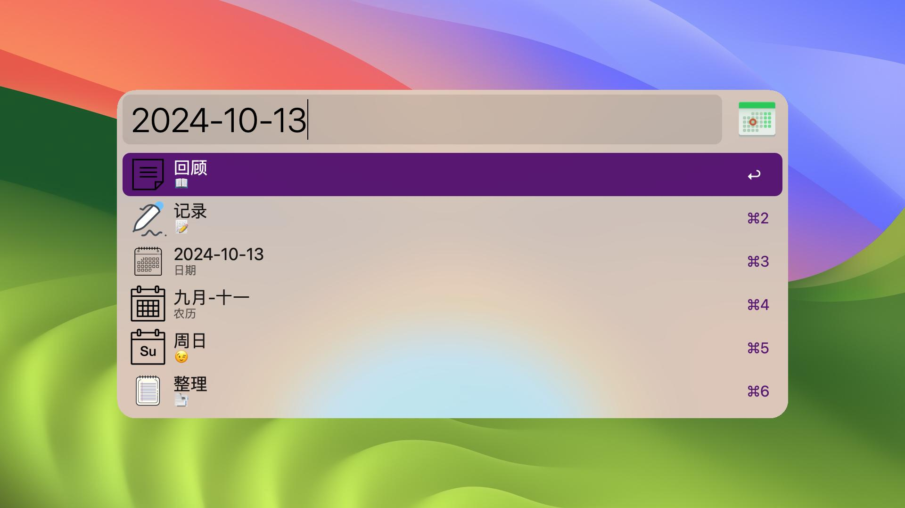

# calendar

## 如何使用

使用关键词`cal`打开日历


选择日期后，回车打开详情


选择`记录`后，输入内容，回车保存


## 特性

- 支持公历、节日、假期
- 支持农历、节气
- 支持记录想法
- 支持回顾想法
- 支持想法整理
- 支持自定义主题色


## 开发

```
make clean && make
```


## 技术点

- Alfred GridView
- Alfred TextView
- Alfred ScriptFilter
